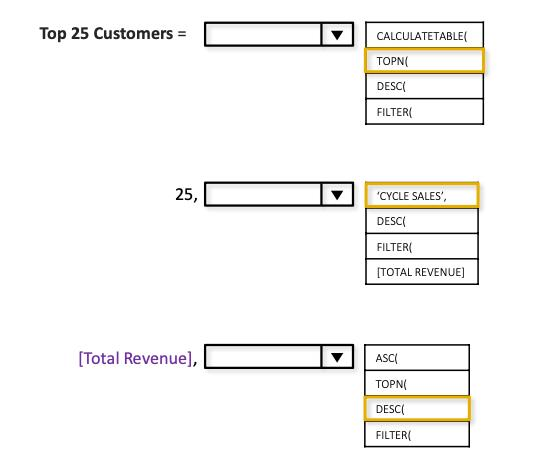

# 抽取的题目

### 题目文件: pyspark-top-sql-50/4_Sorting_and_Grouping/27_1729_Find_Followers_Count.ipynb

{
 "cells": [
  {
   "cell_type": "markdown",
   "source": [
    "# [1729. Find Followers Count](https://leetcode.com/problems/find-followers-count/description/?envType=study-plan-v2&envId=top-sql-50)"
   ],
   "metadata": {
    "collapsed": false
   },
   "id": "8686b228cfb0c498"
  },
  {
   "cell_type": "markdown",
   "source": [
    "Table: Followers\n",
    "\n",
    "+-------------+------+\n",
    "| Column Name | Type |\n",
    "+-------------+------+\n",
    "| user_id     | int  |\n",
    "| follower_id | int  |\n",
    "+-------------+------+\n",
    "(user_id, follower_id) is the primary key (combination of columns with unique values) for this table.\n",
    "This table contains the IDs of a user and a follower in a social media app where the follower follows the user.\n",
    " \n",
    "\n",
    "Write a solution that will, for each user, return the number of followers.\n",
    "\n",
    "Return the result table ordered by user_id in ascending order.\n",
    "\n",
    "The result format is in the following example.\n",
    "\n",
    " \n",
    "\n",
    "Example 1:\n",
    "\n",
    "Input: \n",
    "Followers table:\n",
    "+---------+-------------+\n",
    "| user_id | follower_id |\n",
    "+---------+-------------+\n",
    "| 0       | 1           |\n",
    "| 1       | 0           |\n",
    "| 2       | 0           |\n",
    "| 2       | 1           |\n",
    "+---------+-------------+\n",
    "Output: \n",
    "+---------+----------------+\n",
    "| user_id | followers_count|\n",
    "+---------+----------------+\n",
    "| 0       | 1              |\n",
    "| 1       | 1              |\n",
    "| 2       | 2              |\n",
    "+---------+----------------+\n",
    "Explanation: \n",
    "The followers of 0 are {1}\n",
    "The followers of 1 are {0}\n",
    "The followers of 2 are {0,1}"
   ],
   "metadata": {
    "collapsed": false
   },
   "id": "8ae6b461f8995c1f"
  },
  {
   "cell_type": "code",
   "execution_count": 1,
   "outputs": [],
   "source": [
    "# pandas schema\n",
    "\n",
    "import pandas as pd\n",
    "\n",
    "data = [['0', '1'], ['1', '0'], ['2', '0'], ['2', '1']]\n",
    "followers = pd.DataFrame(data, columns=['user_id', 'follower_id']).astype({'user_id': 'Int64', 'follower_id': 'Int64'})"
   ],
   "metadata": {
    "collapsed": false,
    "ExecuteTime": {
     "end_time": "2023-11-11T23:45:53.986027700Z",
     "start_time": "2023-11-11T23:45:53.541160200Z"
    }
   },
   "id": "b7b8af73ef55c79d"
  },
  {
   "cell_type": "code",
   "execution_count": 2,
   "outputs": [
    {
     "name": "stderr",
     "output_type": "stream",
     "text": [
      "bash: warning: setlocale: LC_ALL: cannot change locale (en_US.UTF-8)\n",
      "bash: warning: setlocale: LC_ALL: cannot change locale (en_US.UTF-8)\n",
      "23/11/11 17:31:48 WARN Utils: Your hostname, svchost resolves to a loopback address: 127.0.1.1; using 172.18.28.34 instead (on interface eth0)\n",
      "23/11/11 17:31:48 WARN Utils: Set SPARK_LOCAL_IP if you need to bind to another address\n",
      "Setting default log level to \"WARN\".\n",
      "To adjust logging level use sc.setLogLevel(newLevel). For SparkR, use setLogLevel(newLevel).\n",
      "23/11/11 17:31:50 WARN NativeCodeLoader: Unable to load native-hadoop library for your platform... using builtin-java classes where applicable\n",
      "                                                                                \r"
     ]
    },
    {
     "name": "stdout",
     "output_type": "stream",
     "text": [
      "+-------+-----------+\n",
      "|user_id|follower_id|\n",
      "+-------+-----------+\n",
      "|      0|          1|\n",
      "|      1|          0|\n",
      "|      2|          0|\n",
      "|      2|          1|\n",
      "+-------+-----------+\n"
     ]
    }
   ],
   "source": [
    "#converting to spark dataframe\n",
    "from pyspark.sql import SparkSession\n",
    "import pyspark.sql.functions as F\n",
    "\n",
    "spark = SparkSession.builder.getOrCreate()\n",
    "\n",
    "followers_df = spark.createDataFrame(followers)\n",
    "followers_df.show()"
   ],
   "metadata": {
    "collapsed": false,
    "ExecuteTime": {
     "end_time": "2023-11-11T23:46:06.934938900Z",
     "start_time": "2023-11-11T23:45:53.991037700Z"
    }
   },
   "id": "a8be92f91ede6142"
  },
  {
   "cell_type": "code",
   "execution_count": 3,
   "outputs": [
    {
     "name": "stderr",
     "output_type": "stream",
     "text": [
      "[Stage 3:>                                                        (0 + 16) / 16]\r"
     ]
    },
    {
     "name": "stdout",
     "output_type": "stream",
     "text": [
      "+-------+---------------+\n",
      "|user_id|followers_count|\n",
      "+-------+---------------+\n",
      "|      0|              1|\n",
      "|      1|              1|\n",
      "|      2|              2|\n",
      "+-------+---------------+\n"
     ]
    },
    {
     "name": "stderr",
     "output_type": "stream",
     "text": [
      "                                                                                \r"
     ]
    }
   ],
   "source": [
    "# solving in spark dataframe\n",
    "\n",
    "followers_df\\\n",
    "    .groupBy('user_id')\\\n",
    "    .agg(F.count('user_id').alias('followers_count'))\\\n",
    "    .orderBy('user_id')\\\n",
    "    .show()"
   ],
   "metadata": {
    "collapsed": false,
    "ExecuteTime": {
     "end_time": "2023-11-11T23:46:09.149403900Z",
     "start_time": "2023-11-11T23:46:06.925946700Z"
    }
   },
   "id": "45b14ceb3d1dffdd"
  },
  {
   "cell_type": "code",
   "execution_count": 4,
   "outputs": [
    {
     "name": "stdout",
     "output_type": "stream",
     "text": [
      "+-------+---------------+\n",
      "|user_id|followers_count|\n",
      "+-------+---------------+\n",
      "|      0|              1|\n",
      "|      1|              1|\n",
      "|      2|              2|\n",
      "+-------+---------------+\n"
     ]
    }
   ],
   "source": [
    "# solving in spark SQL\n",
    "\n",
    "followers_df.createOrReplaceTempView('followers')\n",
    "\n",
    "spark.sql('''\n",
    "select \n",
    "    user_id,\n",
    "    count(user_id) as followers_count\n",
    "from followers\n",
    "group by user_id\n",
    "order by user_id;\n",
    "''').show()"
   ],
   "metadata": {
    "collapsed": false,
    "ExecuteTime": {
     "end_time": "2023-11-11T23:46:10.094016300Z",
     "start_time": "2023-11-11T23:46:09.149403900Z"
    }
   },
   "id": "280bb63d848bb048"
  },
  {
   "cell_type": "code",
   "execution_count": 5,
   "outputs": [],
   "source": [
    "spark.stop()"
   ],
   "metadata": {
    "collapsed": false,
    "ExecuteTime": {
     "end_time": "2023-11-11T23:46:11.001120600Z",
     "start_time": "2023-11-11T23:46:10.090122Z"
    }
   },
   "id": "2b943065ae414bd3"
  }
 ],
 "metadata": {
  "kernelspec": {
   "display_name": "Python 3",
   "language": "python",
   "name": "python3"
  },
  "language_info": {
   "codemirror_mode": {
    "name": "ipython",
    "version": 2
   },
   "file_extension": ".py",
   "mimetype": "text/x-python",
   "name": "python",
   "nbconvert_exporter": "python",
   "pygments_lexer": "ipython2",
   "version": "2.7.6"
  }
 },
 "nbformat": 4,
 "nbformat_minor": 5
}

### 题目文件: pyspark-top-sql-50/1_Select/02_584_Find_Customer_Referee.ipynb

{
 "cells": [
  {
   "cell_type": "markdown",
   "source": [
    "# [584. Find Customer Referee](https://leetcode.com/problems/find-customer-referee/description/?envType=study-plan-v2&envId=top-sql-50)"
   ],
   "metadata": {
    "collapsed": false
   },
   "id": "bcce7454fa67d076"
  },
  {
   "cell_type": "markdown",
   "source": [
    "Table: Customer\n",
    "\n",
    "\n",
    "+-------------+---------+\n",
    "| Column Name | Type    |\n",
    "+-------------+---------+\n",
    "| id          | int     |\n",
    "| name        | varchar |\n",
    "| referee_id  | int     |\n",
    "+-------------+---------+\n",
    "In SQL, id is the primary key column for this table.\n",
    "Each row of this table indicates the id of a customer, their name, and the id of the customer who referred them.\n",
    " \n",
    "\n",
    "Find the names of the customer that are not referred by the customer with id = 2.\n",
    "\n",
    "Return the result table in any order.\n",
    "\n",
    "The result format is in the following example.\n",
    "\n",
    " \n",
    "\n",
    "Example 1:\n",
    "\n",
    "Input: \n",
    "Customer table:\n",
    "\n",
    "+----+------+------------+\n",
    "| id | name | referee_id |\n",
    "+----+------+------------+\n",
    "| 1  | Will | null       |\n",
    "| 2  | Jane | null       |\n",
    "| 3  | Alex | 2          |\n",
    "| 4  | Bill | null       |\n",
    "| 5  | Zack | 1          |\n",
    "| 6  | Mark | 2          |\n",
    "+----+------+------------+\n",
    "\n",
    "Output:\n",
    " \n",
    "+------+\n",
    "| name |\n",
    "+------+\n",
    "| Will |\n",
    "| Jane |\n",
    "| Bill |\n",
    "| Zack |\n",
    "+------+\n",
    ""
   ],
   "metadata": {
    "collapsed": false
   },
   "id": "62cafc9d657a37e8"
  },
  {
   "cell_type": "code",
   "execution_count": 1,
   "outputs": [],
   "source": [
    "# Pandas Schema\n",
    "\n",
    "import pandas as pd\n",
    "\n",
    "data = [[1, 'Will', None], [2, 'Jane', None], [3, 'Alex', 2], [4, 'Bill', None], [5, 'Zack', 1], [6, 'Mark', 2]]\n",
    "customer = pd.DataFrame(data, columns=['id', 'name', 'referee_id']).astype(\n",
    "    {'id': 'Int64', 'name': 'object', 'referee_id': 'Int64'})"
   ],
   "metadata": {
    "collapsed": false,
    "ExecuteTime": {
     "end_time": "2023-11-05T16:39:36.232480900Z",
     "start_time": "2023-11-05T16:39:35.639760400Z"
    }
   },
   "id": "f534cc706741fd16"
  },
  {
   "cell_type": "code",
   "execution_count": 2,
   "outputs": [
    {
     "data": {
      "text/plain": "   id  name  referee_id\n0   1  Will        \n1   2  Jane        \n2   3  Alex           2\n3   4  Bill        \n4   5  Zack           1\n5   6  Mark           2",
      "text/html": "\n\n    .dataframe tbody tr th:only-of-type {\n        vertical-align: middle;\n    }\n\n    .dataframe tbody tr th {\n        vertical-align: top;\n    }\n\n    .dataframe thead th {\n        text-align: right;\n    }\n\n\n  \n    \n      \n      id\n      name\n      referee_id\n    \n  \n  \n    \n      0\n      1\n      Will\n      &lt;NA&gt;\n    \n    \n      1\n      2\n      Jane\n      &lt;NA&gt;\n    \n    \n      2\n      3\n      Alex\n      2\n    \n    \n      3\n      4\n      Bill\n      &lt;NA&gt;\n    \n    \n      4\n      5\n      Zack\n      1\n    \n    \n      5\n      6\n      Mark\n      2\n    \n  \n\n"
     },
     "execution_count": 2,
     "metadata": {},
     "output_type": "execute_result"
    }
   ],
   "source": [
    "customer"
   ],
   "metadata": {
    "collapsed": false,
    "ExecuteTime": {
     "end_time": "2023-11-05T16:39:36.264481900Z",
     "start_time": "2023-11-05T16:39:36.244084400Z"
    }
   },
   "id": "3ee4a620fbc150b8"
  },
  {
   "cell_type": "code",
   "execution_count": 3,
   "outputs": [],
   "source": [
    "#To pyspark schema\n",
    "\n",
    "from pyspark.sql.types import *\n",
    "from pyspark.sql import SparkSession\n",
    "import pyspark.sql.functions as F\n",
    "\n",
    "# Spark has issues with null values when using Pandas' Int64 data type, hence creating a Spark schema\n",
    "schema = StructType([\n",
    "    StructField(\"id\", IntegerType(), True),\n",
    "    StructField(\"name\", StringType(), True),\n",
    "    StructField(\"referee_id\", IntegerType(), True)\n",
    "])"
   ],
   "metadata": {
    "collapsed": false,
    "ExecuteTime": {
     "end_time": "2023-11-05T16:39:36.476102900Z",
     "start_time": "2023-11-05T16:39:36.263049700Z"
    }
   },
   "id": "4e00eb4aa7c62213"
  },
  {
   "cell_type": "code",
   "execution_count": 4,
   "outputs": [
    {
     "name": "stderr",
     "output_type": "stream",
     "text": [
      "bash: warning: setlocale: LC_ALL: cannot change locale (en_US.UTF-8)\n",
      "bash: warning: setlocale: LC_ALL: cannot change locale (en_US.UTF-8)\n",
      "23/11/05 10:39:38 WARN Utils: Your hostname, svchost resolves to a loopback address: 127.0.1.1; using 172.18.28.34 instead (on interface eth0)\n",
      "23/11/05 10:39:38 WARN Utils: Set SPARK_LOCAL_IP if you need to bind to another address\n",
      "Setting default log level to \"WARN\".\n",
      "To adjust logging level use sc.setLogLevel(newLevel). For SparkR, use setLogLevel(newLevel).\n",
      "23/11/05 10:39:40 WARN NativeCodeLoader: Unable to load native-hadoop library for your platform... using builtin-java classes where applicable\n",
      "                                                                                \r"
     ]
    },
    {
     "name": "stdout",
     "output_type": "stream",
     "text": [
      "+---+----+----------+\n",
      "|id |name|referee_id|\n",
      "+---+----+----------+\n",
      "|1  |Will|null      |\n",
      "|2  |Jane|null      |\n",
      "|3  |Alex|2         |\n",
      "|4  |Bill|null      |\n",
      "|5  |Zack|1         |\n",
      "|6  |Mark|2         |\n",
      "+---+----+----------+\n"
     ]
    }
   ],
   "source": [
    "spark = SparkSession.builder.getOrCreate()\n",
    "\n",
    "customer_df = spark.createDataFrame(data, schema=schema)\n",
    "customer_df.show(truncate=False)"
   ],
   "metadata": {
    "collapsed": false,
    "ExecuteTime": {
     "end_time": "2023-11-05T16:39:52.359652800Z",
     "start_time": "2023-11-05T16:39:36.344323700Z"
    }
   },
   "id": "ca7cde997baaa96f"
  },
  {
   "cell_type": "code",
   "execution_count": 5,
   "outputs": [
    {
     "name": "stdout",
     "output_type": "stream",
     "text": [
      "+----+\n",
      "|name|\n",
      "+----+\n",
      "|Will|\n",
      "|Jane|\n",
      "|Bill|\n",
      "|Zack|\n",
      "+----+\n"
     ]
    }
   ],
   "source": [
    "# in Spark Dataframe\n",
    "customer_df.filter((F.col('referee_id').isNull()) | (F.col('referee_id') != 2)).select('name').show()"
   ],
   "metadata": {
    "collapsed": false,
    "ExecuteTime": {
     "end_time": "2023-11-05T16:39:53.459246Z",
     "start_time": "2023-11-05T16:39:52.355588800Z"
    }
   },
   "id": "9c647b45dc8ee9da"
  },
  {
   "cell_type": "code",
   "execution_count": 6,
   "outputs": [
    {
     "name": "stdout",
     "output_type": "stream",
     "text": [
      "+----+\n",
      "|name|\n",
      "+----+\n",
      "|Will|\n",
      "|Jane|\n",
      "|Bill|\n",
      "|Zack|\n",
      "+----+\n"
     ]
    }
   ],
   "source": [
    "# in Spark SQL\n",
    "customer_df.createOrReplaceTempView('customer')\n",
    "spark.sql('''\n",
    "select name from customer where referee_id is null or referee_id!=2;\n",
    "''').show()"
   ],
   "metadata": {
    "collapsed": false,
    "ExecuteTime": {
     "end_time": "2023-11-05T16:39:54.538497700Z",
     "start_time": "2023-11-05T16:39:53.451024700Z"
    }
   },
   "id": "fbe69d8b8cc3845"
  },
  {
   "cell_type": "code",
   "execution_count": 7,
   "outputs": [],
   "source": [
    "spark.stop()"
   ],
   "metadata": {
    "collapsed": false,
    "ExecuteTime": {
     "end_time": "2023-11-05T16:39:55.518727800Z",
     "start_time": "2023-11-05T16:39:54.522285800Z"
    }
   },
   "id": "3b09d0d3e7837236"
  },
  {
   "cell_type": "code",
   "execution_count": 7,
   "outputs": [],
   "source": [],
   "metadata": {
    "collapsed": false,
    "ExecuteTime": {
     "end_time": "2023-11-05T16:39:55.583130500Z",
     "start_time": "2023-11-05T16:39:55.525444800Z"
    }
   },
   "id": "9eb1780728b7d230"
  }
 ],
 "metadata": {
  "kernelspec": {
   "display_name": "Python 3",
   "language": "python",
   "name": "python3"
  },
  "language_info": {
   "codemirror_mode": {
    "name": "ipython",
    "version": 2
   },
   "file_extension": ".py",
   "mimetype": "text/x-python",
   "name": "python",
   "nbconvert_exporter": "python",
   "pygments_lexer": "ipython2",
   "version": "2.7.6"
  }
 },
 "nbformat": 4,
 "nbformat_minor": 5
}

### 题目文件: pyspark-top-sql-50/3_Basic_Aggregate_Functions/19_1211_Queries_Quality_and_Percentage.ipynb

{
 "cells": [
  {
   "cell_type": "markdown",
   "source": [
    "# [1211. Queries Quality and Percentage](https://leetcode.com/problems/queries-quality-and-percentage/description/?envType=study-plan-v2&envId=top-sql-50)"
   ],
   "metadata": {
    "collapsed": false
   },
   "id": "9a2d5d20840777b1"
  },
  {
   "cell_type": "markdown",
   "source": [
    "Table: Queries\n",
    "\n",
    "+-------------+---------+\n",
    "| Column Name | Type    |\n",
    "+-------------+---------+\n",
    "| query_name  | varchar |\n",
    "| result      | varchar |\n",
    "| position    | int     |\n",
    "| rating      | int     |\n",
    "+-------------+---------+\n",
    "This table may have duplicate rows.\n",
    "This table contains information collected from some queries on a database.\n",
    "The position column has a value from 1 to 500.\n",
    "The rating column has a value from 1 to 5. Query with rating less than 3 is a poor query.\n",
    " \n",
    "\n",
    "We define query quality as:\n",
    "\n",
    "The average of the ratio between query rating and its position.\n",
    "\n",
    "We also define poor query percentage as:\n",
    "\n",
    "The percentage of all queries with rating less than 3.\n",
    "\n",
    "Write a solution to find each query_name, the quality and poor_query_percentage.\n",
    "\n",
    "Both quality and poor_query_percentage should be rounded to 2 decimal places.\n",
    "\n",
    "Return the result table in any order.\n",
    "\n",
    "The result format is in the following example.\n",
    "\n",
    " \n",
    "\n",
    "Example 1:\n",
    "\n",
    "Input: \n",
    "Queries table:\n",
    "+------------+-------------------+----------+--------+\n",
    "| query_name | result            | position | rating |\n",
    "+------------+-------------------+----------+--------+\n",
    "| Dog        | Golden Retriever  | 1        | 5      |\n",
    "| Dog        | German Shepherd   | 2        | 5      |\n",
    "| Dog        | Mule              | 200      | 1      |\n",
    "| Cat        | Shirazi           | 5        | 2      |\n",
    "| Cat        | Siamese           | 3        | 3      |\n",
    "| Cat        | Sphynx            | 7        | 4      |\n",
    "+------------+-------------------+----------+--------+\n",
    "Output: \n",
    "+------------+---------+-----------------------+\n",
    "| query_name | quality | poor_query_percentage |\n",
    "+------------+---------+-----------------------+\n",
    "| Dog        | 2.50    | 33.33                 |\n",
    "| Cat        | 0.66    | 33.33                 |\n",
    "+------------+---------+-----------------------+\n",
    "Explanation: \n",
    "Dog queries quality is ((5 / 1) + (5 / 2) + (1 / 200)) / 3 = 2.50\n",
    "Dog queries poor_ query_percentage is (1 / 3) * 100 = 33.33\n",
    "\n",
    "Cat queries quality equals ((2 / 5) + (3 / 3) + (4 / 7)) / 3 = 0.66\n",
    "Cat queries poor_ query_percentage is (1 / 3) * 100 = 33.33"
   ],
   "metadata": {
    "collapsed": false
   },
   "id": "570ef9dae94a1926"
  },
  {
   "cell_type": "code",
   "execution_count": 1,
   "outputs": [],
   "source": [
    "#pandas schema\n",
    "import pandas as pd\n",
    "\n",
    "data = [['Dog', 'Golden Retriever', 1, 5], ['Dog', 'German Shepherd', 2, 5], ['Dog', 'Mule', 200, 1],\n",
    "        ['Cat', 'Shirazi', 5, 2], ['Cat', 'Siamese', 3, 3], ['Cat', 'Sphynx', 7, 4]]\n",
    "queries = pd.DataFrame(data, columns=['query_name', 'result', 'position', 'rating']).astype(\n",
    "    {'query_name': 'object', 'result': 'object', 'position': 'Int64', 'rating': 'Int64'})"
   ],
   "metadata": {
    "collapsed": false,
    "ExecuteTime": {
     "end_time": "2023-11-10T00:55:27.217981900Z",
     "start_time": "2023-11-10T00:55:26.843069300Z"
    }
   },
   "id": "e47fb41e9cf566a2"
  },
  {
   "cell_type": "code",
   "execution_count": 2,
   "outputs": [
    {
     "name": "stderr",
     "output_type": "stream",
     "text": [
      "bash: warning: setlocale: LC_ALL: cannot change locale (en_US.UTF-8)\n",
      "bash: warning: setlocale: LC_ALL: cannot change locale (en_US.UTF-8)\n",
      "23/11/09 13:00:22 WARN Utils: Your hostname, svchost resolves to a loopback address: 127.0.1.1; using 172.18.28.34 instead (on interface eth0)\n",
      "23/11/09 13:00:22 WARN Utils: Set SPARK_LOCAL_IP if you need to bind to another address\n",
      "Setting default log level to \"WARN\".\n",
      "To adjust logging level use sc.setLogLevel(newLevel). For SparkR, use setLogLevel(newLevel).\n",
      "23/11/09 13:00:24 WARN NativeCodeLoader: Unable to load native-hadoop library for your platform... using builtin-java classes where applicable\n",
      "                                                                                \r"
     ]
    },
    {
     "name": "stdout",
     "output_type": "stream",
     "text": [
      "+----------+----------------+--------+------+\n",
      "|query_name|result          |position|rating|\n",
      "+----------+----------------+--------+------+\n",
      "|Dog       |Golden Retriever|1       |5     |\n",
      "|Dog       |German Shepherd |2       |5     |\n",
      "|Dog       |Mule            |200     |1     |\n",
      "|Cat       |Shirazi         |5       |2     |\n",
      "|Cat       |Siamese         |3       |3     |\n",
      "|Cat       |Sphynx          |7       |4     |\n",
      "+----------+----------------+--------+------+\n"
     ]
    }
   ],
   "source": [
    "#to pyspark df\n",
    "\n",
    "from pyspark.sql import SparkSession\n",
    "import pyspark.sql.functions as F\n",
    "\n",
    "spark = SparkSession.builder.getOrCreate()\n",
    "\n",
    "queries_df = spark.createDataFrame(queries)\n",
    "queries_df.show(truncate=False)"
   ],
   "metadata": {
    "collapsed": false,
    "ExecuteTime": {
     "end_time": "2023-11-10T00:55:39.254637600Z",
     "start_time": "2023-11-10T00:55:27.223178900Z"
    }
   },
   "id": "5c02f4e381c81533"
  },
  {
   "cell_type": "code",
   "execution_count": 3,
   "outputs": [
    {
     "name": "stderr",
     "output_type": "stream",
     "text": [
      "[Stage 3:>                                                        (0 + 16) / 16]\r"
     ]
    },
    {
     "name": "stdout",
     "output_type": "stream",
     "text": [
      "+----------+-------+---------------------+\n",
      "|query_name|quality|poor_query_percentage|\n",
      "+----------+-------+---------------------+\n",
      "|       Dog|    2.5|                33.33|\n",
      "|       Cat|   0.66|                33.33|\n",
      "+----------+-------+---------------------+\n"
     ]
    },
    {
     "name": "stderr",
     "output_type": "stream",
     "text": [
      "                                                                                \r"
     ]
    }
   ],
   "source": [
    "# solving in spark dataframe\n",
    "\n",
    "queries_df \\\n",
    "    .groupBy('query_name') \\\n",
    "    .agg(\n",
    "    F.round(F.avg(F.col('rating') / F.col('position')), 2).alias('quality'),\n",
    "    F.round(F.avg(F.when(F.col('rating') < 3, 1).otherwise(0)) * 100, 2).alias('poor_query_percentage')\n",
    ").show()"
   ],
   "metadata": {
    "collapsed": false,
    "ExecuteTime": {
     "end_time": "2023-11-10T00:55:41.157230200Z",
     "start_time": "2023-11-10T00:55:39.250119200Z"
    }
   },
   "id": "73a41045e5f4d1be"
  },
  {
   "cell_type": "code",
   "execution_count": 4,
   "outputs": [
    {
     "name": "stdout",
     "output_type": "stream",
     "text": [
      "+----------+-------+---------------------+\n",
      "|query_name|quality|poor_query_percentage|\n",
      "+----------+-------+---------------------+\n",
      "|       Dog|    2.5|                33.33|\n",
      "|       Cat|   0.66|                33.33|\n",
      "+----------+-------+---------------------+\n"
     ]
    }
   ],
   "source": [
    "# solving in spark sql\n",
    "\n",
    "queries_df.createOrReplaceTempView('queries')\n",
    "\n",
    "spark.sql('''\n",
    "select \n",
    "    query_name, \n",
    "    round(avg(rating/position),2) as quality,\n",
    "    round(100*avg(case when rating<3 then 1 else 0 end),2) as poor_query_percentage\n",
    "from queries\n",
    "group by query_name;\n",
    "''').show()"
   ],
   "metadata": {
    "collapsed": false,
    "ExecuteTime": {
     "end_time": "2023-11-10T00:55:42.139589600Z",
     "start_time": "2023-11-10T00:55:41.145592800Z"
    }
   },
   "id": "cfbf1cf85404243d"
  },
  {
   "cell_type": "code",
   "execution_count": 5,
   "outputs": [],
   "source": [
    "spark.stop()"
   ],
   "metadata": {
    "collapsed": false,
    "ExecuteTime": {
     "end_time": "2023-11-10T00:55:43.110158400Z",
     "start_time": "2023-11-10T00:55:42.137999600Z"
    }
   },
   "id": "983cba0c7b0165de"
  }
 ],
 "metadata": {
  "kernelspec": {
   "display_name": "Python 3",
   "language": "python",
   "name": "python3"
  },
  "language_info": {
   "codemirror_mode": {
    "name": "ipython",
    "version": 2
   },
   "file_extension": ".py",
   "mimetype": "text/x-python",
   "name": "python",
   "nbconvert_exporter": "python",
   "pygments_lexer": "ipython2",
   "version": "2.7.6"
  }
 },
 "nbformat": 4,
 "nbformat_minor": 5
}

### 题目文件: pyspark-top-sql-50/2_Basic_Joins/06_1378_Replace_Employee_ID_With_The_Unique_Identifier.ipynb

{
 "cells": [
  {
   "cell_type": "markdown",
   "source": [
    "# [1378. Replace Employee ID With The Unique Identifier](https://leetcode.com/problems/replace-employee-id-with-the-unique-identifier/description/?envType=study-plan-v2&envId=top-sql-50)"
   ],
   "metadata": {
    "collapsed": false
   },
   "id": "4f2ef0c272e6c920"
  },
  {
   "cell_type": "markdown",
   "source": [
    "Table: Employees\n",
    "\n",
    "+---------------+---------+\n",
    "| Column Name   | Type    |\n",
    "+---------------+---------+\n",
    "| id            | int     |\n",
    "| name          | varchar |\n",
    "+---------------+---------+\n",
    "id is the primary key (column with unique values) for this table.\n",
    "Each row of this table contains the id and the name of an employee in a company.\n",
    " \n",
    "\n",
    "Table: EmployeeUNI\n",
    "\n",
    "+---------------+---------+\n",
    "| Column Name   | Type    |\n",
    "+---------------+---------+\n",
    "| id            | int     |\n",
    "| unique_id     | int     |\n",
    "+---------------+---------+\n",
    "(id, unique_id) is the primary key (combination of columns with unique values) for this table.\n",
    "Each row of this table contains the id and the corresponding unique id of an employee in the company.\n",
    " \n",
    "\n",
    "Write a solution to show the unique ID of each user, If a user does not have a unique ID replace just show null.\n",
    "\n",
    "Return the result table in any order.\n",
    "\n",
    "The result format is in the following example.\n",
    "\n",
    " \n",
    "\n",
    "Example 1:\n",
    "\n",
    "Input: \n",
    "Employees table:\n",
    "+----+----------+\n",
    "| id | name     |\n",
    "+----+----------+\n",
    "| 1  | Alice    |\n",
    "| 7  | Bob      |\n",
    "| 11 | Meir     |\n",
    "| 90 | Winston  |\n",
    "| 3  | Jonathan |\n",
    "+----+----------+\n",
    "EmployeeUNI table:\n",
    "+----+-----------+\n",
    "| id | unique_id |\n",
    "+----+-----------+\n",
    "| 3  | 1         |\n",
    "| 11 | 2         |\n",
    "| 90 | 3         |\n",
    "+----+-----------+\n",
    "Output: \n",
    "+-----------+----------+\n",
    "| unique_id | name     |\n",
    "+-----------+----------+\n",
    "| null      | Alice    |\n",
    "| null      | Bob      |\n",
    "| 2         | Meir     |\n",
    "| 3         | Winston  |\n",
    "| 1         | Jonathan |\n",
    "+-----------+----------+\n",
    "Explanation: \n",
    "Alice and Bob do not have a unique ID, We will show null instead.\n",
    "The unique ID of Meir is 2.\n",
    "The unique ID of Winston is 3.\n",
    "The unique ID of Jonathan is 1."
   ],
   "metadata": {
    "collapsed": false
   },
   "id": "8833a5b06fff9667"
  },
  {
   "cell_type": "code",
   "execution_count": 1,
   "outputs": [],
   "source": [
    "#Pandas Schema\n",
    "import pandas as pd\n",
    "\n",
    "data = [[1, 'Alice'], [7, 'Bob'], [11, 'Meir'], [90, 'Winston'], [3, 'Jonathan']]\n",
    "employees = pd.DataFrame(data, columns=['id', 'name']).astype({'id':'int64', 'name':'object'})\n",
    "data = [[3, 1], [11, 2], [90, 3]]\n",
    "employee_uni = pd.DataFrame(data, columns=['id', 'unique_id']).astype({'id':'int64', 'unique_id':'int64'})"
   ],
   "metadata": {
    "collapsed": false,
    "ExecuteTime": {
     "end_time": "2023-11-05T18:55:50.805514300Z",
     "start_time": "2023-11-05T18:55:50.263464800Z"
    }
   },
   "id": "9858a8e925b70a5a"
  },
  {
   "cell_type": "code",
   "execution_count": 2,
   "outputs": [
    {
     "name": "stderr",
     "output_type": "stream",
     "text": [
      "bash: warning: setlocale: LC_ALL: cannot change locale (en_US.UTF-8)\n",
      "bash: warning: setlocale: LC_ALL: cannot change locale (en_US.UTF-8)\n",
      "23/11/05 12:01:05 WARN Utils: Your hostname, svchost resolves to a loopback address: 127.0.1.1; using 172.18.28.34 instead (on interface eth0)\n",
      "23/11/05 12:01:05 WARN Utils: Set SPARK_LOCAL_IP if you need to bind to another address\n",
      "Setting default log level to \"WARN\".\n",
      "To adjust logging level use sc.setLogLevel(newLevel). For SparkR, use setLogLevel(newLevel).\n",
      "23/11/05 12:01:08 WARN NativeCodeLoader: Unable to load native-hadoop library for your platform... using builtin-java classes where applicable\n",
      "                                                                                \r"
     ]
    },
    {
     "name": "stdout",
     "output_type": "stream",
     "text": [
      "+---+--------+\n",
      "|id |name    |\n",
      "+---+--------+\n",
      "|1  |Alice   |\n",
      "|7  |Bob     |\n",
      "|11 |Meir    |\n",
      "|90 |Winston |\n",
      "|3  |Jonathan|\n",
      "+---+--------+\n"
     ]
    }
   ],
   "source": [
    "#to pyspark schema\n",
    "\n",
    "from pyspark.sql import SparkSession\n",
    "\n",
    "spark = SparkSession.builder.getOrCreate()\n",
    "\n",
    "employees_df = spark.createDataFrame(employees)\n",
    "employees_df.show(truncate=False)"
   ],
   "metadata": {
    "collapsed": false,
    "ExecuteTime": {
     "end_time": "2023-11-05T18:56:08.274792400Z",
     "start_time": "2023-11-05T18:55:50.811021500Z"
    }
   },
   "id": "54538ea9e380a87e"
  },
  {
   "cell_type": "code",
   "execution_count": 3,
   "outputs": [
    {
     "name": "stdout",
     "output_type": "stream",
     "text": [
      "+---+---------+\n",
      "|id |unique_id|\n",
      "+---+---------+\n",
      "|3  |1        |\n",
      "|11 |2        |\n",
      "|90 |3        |\n",
      "+---+---------+\n"
     ]
    }
   ],
   "source": [
    "employee_uni_df = spark.createDataFrame(employee_uni)\n",
    "employee_uni_df.show(truncate=False)"
   ],
   "metadata": {
    "collapsed": false,
    "ExecuteTime": {
     "end_time": "2023-11-05T18:56:09.473630200Z",
     "start_time": "2023-11-05T18:56:08.262775700Z"
    }
   },
   "id": "176a4a8e320f176e"
  },
  {
   "cell_type": "code",
   "execution_count": 4,
   "outputs": [
    {
     "name": "stderr",
     "output_type": "stream",
     "text": [
      "                                                                                \r"
     ]
    },
    {
     "name": "stdout",
     "output_type": "stream",
     "text": [
      "+---------+--------+\n",
      "|unique_id|    name|\n",
      "+---------+--------+\n",
      "|     null|   Alice|\n",
      "|     null|     Bob|\n",
      "|        2|    Meir|\n",
      "|        3| Winston|\n",
      "|        1|Jonathan|\n",
      "+---------+--------+\n"
     ]
    }
   ],
   "source": [
    "# in spark Dafaframe\n",
    "\n",
    "employees_df\\\n",
    "    .join(employee_uni_df,on=['id'],how='left')\\\n",
    "    .select('unique_id','name')\\\n",
    "    .show()"
   ],
   "metadata": {
    "collapsed": false,
    "ExecuteTime": {
     "end_time": "2023-11-05T18:56:11.918252300Z",
     "start_time": "2023-11-05T18:56:09.468227100Z"
    }
   },
   "id": "7c265c30edfbf76a"
  },
  {
   "cell_type": "code",
   "execution_count": 5,
   "outputs": [
    {
     "name": "stderr",
     "output_type": "stream",
     "text": [
      "[Stage 13:=============================================>          (13 + 3) / 16]\r"
     ]
    },
    {
     "name": "stdout",
     "output_type": "stream",
     "text": [
      "+---------+--------+\n",
      "|unique_id|    name|\n",
      "+---------+--------+\n",
      "|     null|   Alice|\n",
      "|     null|     Bob|\n",
      "|        2|    Meir|\n",
      "|        3| Winston|\n",
      "|        1|Jonathan|\n",
      "+---------+--------+\n"
     ]
    },
    {
     "name": "stderr",
     "output_type": "stream",
     "text": [
      "                                                                                \r"
     ]
    }
   ],
   "source": [
    "# in spark SQL\n",
    "\n",
    "employees_df.createOrReplaceTempView('employees')\n",
    "employee_uni_df.createOrReplaceTempView('employee_uni')\n",
    "\n",
    "spark.sql('''\n",
    "select unique_id, name\n",
    "from employees\n",
    "left join employee_uni \n",
    "on employees.id = employee_uni.id;\n",
    "''').show()"
   ],
   "metadata": {
    "collapsed": false,
    "ExecuteTime": {
     "end_time": "2023-11-05T18:56:13.707262300Z",
     "start_time": "2023-11-05T18:56:11.922433300Z"
    }
   },
   "id": "89f827a905c69a79"
  },
  {
   "cell_type": "code",
   "execution_count": 6,
   "outputs": [],
   "source": [
    "spark.stop()"
   ],
   "metadata": {
    "collapsed": false,
    "ExecuteTime": {
     "end_time": "2023-11-05T18:56:14.152656600Z",
     "start_time": "2023-11-05T18:56:13.453788100Z"
    }
   },
   "id": "6f51ccc802d24c64"
  },
  {
   "cell_type": "code",
   "execution_count": 6,
   "outputs": [],
   "source": [],
   "metadata": {
    "collapsed": false,
    "ExecuteTime": {
     "end_time": "2023-11-05T18:56:14.207768800Z",
     "start_time": "2023-11-05T18:56:14.156848200Z"
    }
   },
   "id": "405f83bfcf69bb8e"
  }
 ],
 "metadata": {
  "kernelspec": {
   "display_name": "Python 3",
   "language": "python",
   "name": "python3"
  },
  "language_info": {
   "codemirror_mode": {
    "name": "ipython",
    "version": 2
   },
   "file_extension": ".py",
   "mimetype": "text/x-python",
   "name": "python",
   "nbconvert_exporter": "python",
   "pygments_lexer": "ipython2",
   "version": "2.7.6"
  }
 },
 "nbformat": 4,
 "nbformat_minor": 5
}

### 题目文件: pyspark-top-sql-50/6_Subqueries/42_585_Investments_In_2016.ipynb

{
 "cells": [
  {
   "cell_type": "markdown",
   "source": [
    "# [585. Investments in 2016](https://leetcode.com/problems/investments-in-2016/description/?envType=study-plan-v2&envId=top-sql-50)"
   ],
   "metadata": {
    "collapsed": false
   },
   "id": "71e6a680c152c714"
  },
  {
   "cell_type": "markdown",
   "source": [
    "Table: Insurance\n",
    "\n",
    "+-------------+-------+\n",
    "| Column Name | Type  |\n",
    "+-------------+-------+\n",
    "| pid         | int   |\n",
    "| tiv_2015    | float |\n",
    "| tiv_2016    | float |\n",
    "| lat         | float |\n",
    "| lon         | float |\n",
    "+-------------+-------+\n",
    "pid is the primary key (column with unique values) for this table.\n",
    "Each row of this table contains information about one policy where:\n",
    "pid is the policyholder's policy ID.\n",
    "tiv_2015 is the total investment value in 2015 and tiv_2016 is the total investment value in 2016.\n",
    "lat is the latitude of the policy holder's city. It's guaranteed that lat is not NULL.\n",
    "lon is the longitude of the policy holder's city. It's guaranteed that lon is not NULL.\n",
    " \n",
    "\n",
    "Write a solution to report the sum of all total investment values in 2016 tiv_2016, for all policyholders who:\n",
    "\n",
    "have the same tiv_2015 value as one or more other policyholders, and\n",
    "are not located in the same city as any other policyholder (i.e., the (lat, lon) attribute pairs must be unique).\n",
    "Round tiv_2016 to two decimal places.\n",
    "\n",
    "The result format is in the following example.\n",
    "\n",
    "Example 1:\n",
    "\n",
    "Input: \n",
    "Insurance table:\n",
    "+-----+----------+----------+-----+-----+\n",
    "| pid | tiv_2015 | tiv_2016 | lat | lon |\n",
    "+-----+----------+----------+-----+-----+\n",
    "| 1   | 10       | 5        | 10  | 10  |\n",
    "| 2   | 20       | 20       | 20  | 20  |\n",
    "| 3   | 10       | 30       | 20  | 20  |\n",
    "| 4   | 10       | 40       | 40  | 40  |\n",
    "+-----+----------+----------+-----+-----+\n",
    "Output: \n",
    "+----------+\n",
    "| tiv_2016 |\n",
    "+----------+\n",
    "| 45.00    |\n",
    "+----------+\n",
    "Explanation: \n",
    "The first record in the table, like the last record, meets both of the two criteria.\n",
    "The tiv_2015 value 10 is the same as the third and fourth records, and its location is unique.\n",
    "\n",
    "The second record does not meet any of the two criteria. Its tiv_2015 is not like any other policyholders and its location is the same as the third record, which makes the third record fail, too.\n",
    "So, the result is the sum of tiv_2016 of the first and last record, which is 45."
   ],
   "metadata": {
    "collapsed": false
   },
   "id": "8f6260f0f3850b5c"
  },
  {
   "cell_type": "code",
   "execution_count": 1,
   "outputs": [],
   "source": [
    "# pandas schema\n",
    "\n",
    "import pandas as pd\n",
    "\n",
    "data = [[1, 10, 5, 10, 10], [2, 20, 20, 20, 20], [3, 10, 30, 20, 20], [4, 10, 40, 40, 40]]\n",
    "insurance = pd.DataFrame(data, columns=['pid', 'tiv_2015', 'tiv_2016', 'lat', 'lon']).astype(\n",
    "    {'pid': 'Int64', 'tiv_2015': 'Float64', 'tiv_2016': 'Float64', 'lat': 'Float64', 'lon': 'Float64'})"
   ],
   "metadata": {
    "collapsed": false,
    "ExecuteTime": {
     "end_time": "2023-11-07T04:09:44.887759600Z",
     "start_time": "2023-11-07T04:09:43.874374Z"
    }
   },
   "id": "2587c5396b8973bd"
  },
  {
   "cell_type": "code",
   "execution_count": 2,
   "outputs": [
    {
     "name": "stderr",
     "output_type": "stream",
     "text": [
      "bash: warning: setlocale: LC_ALL: cannot change locale (en_US.UTF-8)\n",
      "bash: warning: setlocale: LC_ALL: cannot change locale (en_US.UTF-8)\n",
      "23/11/06 16:09:47 WARN Utils: Your hostname, svchost resolves to a loopback address: 127.0.1.1; using 172.18.28.34 instead (on interface eth0)\n",
      "23/11/06 16:09:47 WARN Utils: Set SPARK_LOCAL_IP if you need to bind to another address\n",
      "Setting default log level to \"WARN\".\n",
      "To adjust logging level use sc.setLogLevel(newLevel). For SparkR, use setLogLevel(newLevel).\n",
      "23/11/06 16:09:49 WARN NativeCodeLoader: Unable to load native-hadoop library for your platform... using builtin-java classes where applicable\n",
      "                                                                                \r"
     ]
    },
    {
     "name": "stdout",
     "output_type": "stream",
     "text": [
      "+---+--------+--------+----+----+\n",
      "|pid|tiv_2015|tiv_2016|lat |lon |\n",
      "+---+--------+--------+----+----+\n",
      "|1  |10.0    |5.0     |10.0|10.0|\n",
      "|2  |20.0    |20.0    |20.0|20.0|\n",
      "|3  |10.0    |30.0    |20.0|20.0|\n",
      "|4  |10.0    |40.0    |40.0|40.0|\n",
      "+---+--------+--------+----+----+\n"
     ]
    }
   ],
   "source": [
    "# pandas df to pyspark df\n",
    "\n",
    "import pyspark.sql.functions as F\n",
    "from pyspark.sql import SparkSession\n",
    "\n",
    "spark = SparkSession.builder.getOrCreate()\n",
    "\n",
    "insurance_df = spark.createDataFrame(insurance)\n",
    "insurance_df.show(truncate=False)"
   ],
   "metadata": {
    "collapsed": false,
    "ExecuteTime": {
     "end_time": "2023-11-07T04:10:03.252705800Z",
     "start_time": "2023-11-07T04:09:44.887759600Z"
    }
   },
   "id": "8c663f5298db7b3b"
  },
  {
   "cell_type": "code",
   "execution_count": 3,
   "outputs": [
    {
     "name": "stdout",
     "output_type": "stream",
     "text": [
      "+--------+\n",
      "|tiv_2016|\n",
      "+--------+\n",
      "|    45.0|\n",
      "+--------+\n"
     ]
    }
   ],
   "source": [
    "from pyspark.sql.window import Window\n",
    "\n",
    "# in Spark Dataframe\n",
    "\n",
    "insurance_df.withColumn('filter_location', F.count(F.concat(F.col('lat'), F.col('lon')))\n",
    "                        .over(Window.partitionBy(F.concat(F.col('lat'), F.col('lon'))))). \\\n",
    "    withColumn('filter_location', F.col('filter_location') == 1). \\\n",
    "    withColumn('filter_tiv_2015', F.count('tiv_2015').over(Window.partitionBy('tiv_2015'))). \\\n",
    "    withColumn('filter_tiv_2015', F.col('filter_tiv_2015') > 1). \\\n",
    "    filter((F.col('filter_tiv_2015') == True) & (F.col('filter_location') == True)). \\\n",
    "    agg(F.round(F.sum('tiv_2016'), 2).alias('tiv_2016')).show()"
   ],
   "metadata": {
    "collapsed": false,
    "ExecuteTime": {
     "end_time": "2023-11-07T04:10:06.296904300Z",
     "start_time": "2023-11-07T04:10:03.250432700Z"
    }
   },
   "id": "d3efeacb8223b679"
  },
  {
   "cell_type": "code",
   "execution_count": 4,
   "outputs": [
    {
     "name": "stdout",
     "output_type": "stream",
     "text": [
      "+--------+\n",
      "|tiv_2016|\n",
      "+--------+\n",
      "|    45.0|\n",
      "+--------+\n"
     ]
    }
   ],
   "source": [
    "# in Spark SQL\n",
    "\n",
    "insurance_df.createOrReplaceTempView('insurance')\n",
    "spark.sql('''\n",
    "select round(sum(tiv_2016),2) as tiv_2016 from \n",
    "(\n",
    "select \n",
    "    *,\n",
    "    count(tiv_2015) over (partition by tiv_2015) as filter_tiv_2015,\n",
    "    count(concat(lat,lon)) over (partition by concat(lat,lon)) as filter_location\n",
    "from insurance\n",
    ") i where filter_tiv_2015>1 and filter_location=1\n",
    "''').show()"
   ],
   "metadata": {
    "collapsed": false,
    "ExecuteTime": {
     "end_time": "2023-11-07T04:10:07.892009700Z",
     "start_time": "2023-11-07T04:10:06.280213600Z"
    }
   },
   "id": "36134f88b7d1be7d"
  },
  {
   "cell_type": "code",
   "execution_count": 5,
   "outputs": [],
   "source": [
    "spark.stop()"
   ],
   "metadata": {
    "collapsed": false,
    "ExecuteTime": {
     "end_time": "2023-11-07T04:10:08.704062800Z",
     "start_time": "2023-11-07T04:10:07.876408800Z"
    }
   },
   "id": "b7b086f22ce002ad"
  }
 ],
 "metadata": {
  "kernelspec": {
   "display_name": "Python 3",
   "language": "python",
   "name": "python3"
  },
  "language_info": {
   "codemirror_mode": {
    "name": "ipython",
    "version": 2
   },
   "file_extension": ".py",
   "mimetype": "text/x-python",
   "name": "python",
   "nbconvert_exporter": "python",
   "pygments_lexer": "ipython2",
   "version": "2.7.6"
  }
 },
 "nbformat": 4,
 "nbformat_minor": 5
}

### 题目文件: pyspark-top-sql-50/5_Advanced_Select_and_Joins/34_1164_Product_Price_at_a_Given_Date.ipynb

{
 "cells": [
  {
   "cell_type": "markdown",
   "source": [
    "# [1164. Product Price at a Given Date](https://leetcode.com/problems/product-price-at-a-given-date/description/?envType=study-plan-v2&envId=top-sql-50)"
   ],
   "metadata": {
    "collapsed": false
   },
   "id": "31ae3b6c6405b34a"
  },
  {
   "cell_type": "markdown",
   "source": [
    "Table: Products\n",
    "\n",
    "+---------------+---------+\n",
    "| Column Name   | Type    |\n",
    "+---------------+---------+\n",
    "| product_id    | int     |\n",
    "| new_price     | int     |\n",
    "| change_date   | date    |\n",
    "+---------------+---------+\n",
    "(product_id, change_date) is the primary key (combination of columns with unique values) of this table.\n",
    "Each row of this table indicates that the price of some product was changed to a new price at some date.\n",
    " \n",
    "\n",
    "Write a solution to find the prices of all products on 2019-08-16. Assume the price of all products before any change is 10.\n",
    "\n",
    "Return the result table in any order.\n",
    "\n",
    "The result format is in the following example.\n",
    "\n",
    " \n",
    "\n",
    "Example 1:\n",
    "\n",
    "Input: \n",
    "Products table:\n",
    "+------------+-----------+-------------+\n",
    "| product_id | new_price | change_date |\n",
    "+------------+-----------+-------------+\n",
    "| 1          | 20        | 2019-08-14  |\n",
    "| 2          | 50        | 2019-08-14  |\n",
    "| 1          | 30        | 2019-08-15  |\n",
    "| 1          | 35        | 2019-08-16  |\n",
    "| 2          | 65        | 2019-08-17  |\n",
    "| 3          | 20        | 2019-08-18  |\n",
    "+------------+-----------+-------------+\n",
    "Output: \n",
    "+------------+-------+\n",
    "| product_id | price |\n",
    "+------------+-------+\n",
    "| 2          | 50    |\n",
    "| 1          | 35    |\n",
    "| 3          | 10    |\n",
    "+------------+-------+"
   ],
   "metadata": {
    "collapsed": false
   },
   "id": "e815efdad737e725"
  },
  {
   "cell_type": "code",
   "execution_count": 1,
   "outputs": [],
   "source": [
    "# Pandas Schema\n",
    "import pandas as pd\n",
    "\n",
    "data = [[1, 20, '2019-08-14'], [2, 50, '2019-08-14'], [1, 30, '2019-08-15'], [1, 35, '2019-08-16'],\n",
    "        [2, 65, '2019-08-17'], [3, 20, '2019-08-18']]\n",
    "\n",
    "# data = [ #test case 4 from leet code\n",
    "#     [1, 20, '2019-08-17'],\n",
    "#     [2, 50, '2019-08-18'],\n",
    "#     [1, 30, '2019-08-15'],\n",
    "#     [1, 35, '2019-08-16'],\n",
    "#     [2, 65, '2019-08-17'],\n",
    "#     [3, 20, '2019-08-18']\n",
    "# ]\n",
    "\n",
    "products = pd.DataFrame(data, columns=['product_id', 'new_price', 'change_date']).astype(\n",
    "    {'product_id': 'Int64', 'new_price': 'Int64', 'change_date': 'datetime64[ns]'})"
   ],
   "metadata": {
    "collapsed": false,
    "ExecuteTime": {
     "end_time": "2023-11-05T19:23:47.711631400Z",
     "start_time": "2023-11-05T19:23:47.056220Z"
    }
   },
   "id": "2cc89de269d42dfb"
  },
  {
   "cell_type": "code",
   "execution_count": 2,
   "outputs": [
    {
     "name": "stderr",
     "output_type": "stream",
     "text": [
      "bash: warning: setlocale: LC_ALL: cannot change locale (en_US.UTF-8)\n",
      "bash: warning: setlocale: LC_ALL: cannot change locale (en_US.UTF-8)\n",
      "23/11/05 12:29:12 WARN Utils: Your hostname, svchost resolves to a loopback address: 127.0.1.1; using 172.18.28.34 instead (on interface eth0)\n",
      "23/11/05 12:29:12 WARN Utils: Set SPARK_LOCAL_IP if you need to bind to another address\n",
      "Setting default log level to \"WARN\".\n",
      "To adjust logging level use sc.setLogLevel(newLevel). For SparkR, use setLogLevel(newLevel).\n",
      "23/11/05 12:29:14 WARN NativeCodeLoader: Unable to load native-hadoop library for your platform... using builtin-java classes where applicable\n",
      "                                                                                \r"
     ]
    },
    {
     "name": "stdout",
     "output_type": "stream",
     "text": [
      "+----------+---------+-------------------+\n",
      "|product_id|new_price|change_date        |\n",
      "+----------+---------+-------------------+\n",
      "|1         |20       |2019-08-14 00:00:00|\n",
      "|2         |50       |2019-08-14 00:00:00|\n",
      "|1         |30       |2019-08-15 00:00:00|\n",
      "|1         |35       |2019-08-16 00:00:00|\n",
      "|2         |65       |2019-08-17 00:00:00|\n",
      "|3         |20       |2019-08-18 00:00:00|\n",
      "+----------+---------+-------------------+\n"
     ]
    }
   ],
   "source": [
    "# to spark schema\n",
    "\n",
    "import pyspark.sql.functions as F\n",
    "from pyspark.sql import SparkSession\n",
    "\n",
    "spark = SparkSession.builder.getOrCreate()\n",
    "\n",
    "products_df = spark.createDataFrame(products)\n",
    "products_df.show(truncate=False)"
   ],
   "metadata": {
    "collapsed": false,
    "ExecuteTime": {
     "end_time": "2023-11-05T19:24:06.649364800Z",
     "start_time": "2023-11-05T19:23:47.720086100Z"
    }
   },
   "id": "293090431e5bbe7"
  },
  {
   "cell_type": "code",
   "execution_count": 3,
   "outputs": [
    {
     "name": "stderr",
     "output_type": "stream",
     "text": [
      "[Stage 3:=========================>                                (7 + 9) / 16]\r"
     ]
    },
    {
     "name": "stdout",
     "output_type": "stream",
     "text": [
      "+----------+-----+\n",
      "|product_id|price|\n",
      "+----------+-----+\n",
      "|         1|   35|\n",
      "+----------+-----+\n"
     ]
    },
    {
     "name": "stderr",
     "output_type": "stream",
     "text": [
      "                                                                                \r"
     ]
    }
   ],
   "source": [
    "# In spark dataframe\n",
    "\n",
    "#only records which has change_date = 2019-08-16\n",
    "pdf1 = products_df\\\n",
    "    .filter(F.col('change_date')=='2019-08-16')\\\n",
    "    .select('product_id',F.col('new_price').alias('price'))\\\n",
    "    .distinct()\n",
    "pdf1.show()"
   ],
   "metadata": {
    "collapsed": false,
    "ExecuteTime": {
     "end_time": "2023-11-05T19:24:09.068662200Z",
     "start_time": "2023-11-05T19:24:06.648474700Z"
    }
   },
   "id": "f997c3f158165df7"
  },
  {
   "cell_type": "code",
   "execution_count": 4,
   "outputs": [
    {
     "name": "stderr",
     "output_type": "stream",
     "text": [
      "                                                                                \r"
     ]
    },
    {
     "name": "stdout",
     "output_type": "stream",
     "text": [
      "+----------+-----+\n",
      "|product_id|price|\n",
      "+----------+-----+\n",
      "|         2|   50|\n",
      "+----------+-----+\n"
     ]
    }
   ],
   "source": [
    "from pyspark.sql import Window\n",
    "\n",
    "\n",
    "#only records which has only change_date  2019-08-16\n",
    "pdf3 = products_df.join(pdf1, on=['product_id'], how = 'anti')\\\n",
    "    .join(pdf2, on=['product_id'], how = 'anti')\\\n",
    "    .withColumn('new_price',F.lit(10))\\\n",
    "    .select('product_id',F.col('new_price').alias('price')).distinct()\n",
    "pdf3.show()"
   ],
   "metadata": {
    "collapsed": false,
    "ExecuteTime": {
     "end_time": "2023-11-05T19:24:13.769365600Z",
     "start_time": "2023-11-05T19:24:11.586323Z"
    }
   },
   "id": "3fdca046e99fe7c7"
  },
  {
   "cell_type": "code",
   "execution_count": 6,
   "outputs": [
    {
     "name": "stderr",
     "output_type": "stream",
     "text": [
      "                                                                                \r"
     ]
    },
    {
     "name": "stdout",
     "output_type": "stream",
     "text": [
      "+----------+-----+\n",
      "|product_id|price|\n",
      "+----------+-----+\n",
      "|         1|   35|\n",
      "|         2|   50|\n",
      "|         3|   10|\n",
      "+----------+-----+\n"
     ]
    }
   ],
   "source": [
    "#now combining all\n",
    "final_df = pdf1.unionAll(pdf2).unionAll(pdf3)\n",
    "final_df.show()"
   ],
   "metadata": {
    "collapsed": false,
    "ExecuteTime": {
     "end_time": "2023-11-05T19:24:16.597197Z",
     "start_time": "2023-11-05T19:24:13.760798Z"
    }
   },
   "id": "74f0c4cb7315fe45"
  },
  {
   "cell_type": "code",
   "execution_count": 7,
   "outputs": [
    {
     "name": "stderr",
     "output_type": "stream",
     "text": [
      "                                                                                \r"
     ]
    },
    {
     "name": "stdout",
     "output_type": "stream",
     "text": [
      "+----------+-----+\n",
      "|product_id|price|\n",
      "+----------+-----+\n",
      "|         1|   35|\n",
      "|         2|   50|\n",
      "|         3|   10|\n",
      "+----------+-----+\n"
     ]
    }
   ],
   "source": [
    "# In spark SQL\n",
    "\n",
    "products_df.createOrReplaceTempView('products')\n",
    "\n",
    "spark.sql('''\n",
    "with pdf1 as (\n",
    "-- #only records which has change_date = 2019-08-16\n",
    "    select distinct product_id, new_price as price \n",
    "    from products\n",
    "    where change_date = '2019-08-16'\n",
    "), pdf2 as (\n",
    "-- #only records which has only change_date  2019-08-16\n",
    "    select distinct products.product_id, 10 as price\n",
    "    from products\n",
    "    left join pdf1\n",
    "    on pdf1.product_id = products.product_id\n",
    "    left join pdf2\n",
    "    on pdf2.product_id = products.product_id\n",
    "    where pdf1.product_id is null and pdf2.product_id is null\n",
    ")\n",
    "select * from pdf1\n",
    "union all\n",
    "select * from pdf2\n",
    "union all\n",
    "select * from pdf3;\n",
    "''').show()"
   ],
   "metadata": {
    "collapsed": false,
    "ExecuteTime": {
     "end_time": "2023-11-05T19:24:19.556895Z",
     "start_time": "2023-11-05T19:24:16.593417Z"
    }
   },
   "id": "b05a2345639009cc"
  },
  {
   "cell_type": "code",
   "execution_count": 8,
   "outputs": [],
   "source": [
    "spark.stop()"
   ],
   "metadata": {
    "collapsed": false,
    "ExecuteTime": {
     "end_time": "2023-11-05T19:24:20.462979900Z",
     "start_time": "2023-11-05T19:24:19.550090500Z"
    }
   },
   "id": "55e04ccfc562fbf2"
  }
 ],
 "metadata": {
  "kernelspec": {
   "display_name": "Python 3",
   "language": "python",
   "name": "python3"
  },
  "language_info": {
   "codemirror_mode": {
    "name": "ipython",
    "version": 2
   },
   "file_extension": ".py",
   "mimetype": "text/x-python",
   "name": "python",
   "nbconvert_exporter": "python",
   "pygments_lexer": "ipython2",
   "version": "2.7.6"
  }
 },
 "nbformat": 4,
 "nbformat_minor": 5
}

### 题目文件: ./powerbi-questions/prepare-the-data.md

5. **From the Power Query editor, what data profiling tool (Data Preview) allows you to only see the percentage of
empty values in each column?**

&emsp;&emsp;&emsp; A. Monospaced

&emsp;&emsp;&emsp; B. Column quality

&emsp;&emsp;&emsp; C. Column distribution

&emsp;&emsp;&emsp; D. Column profile

> B, Column quality

2. **How would you complete the following DAX calculated table expression, so it returns a table of the top 25 customers based on Total Revenue?**



``` sql
[Top 25 Customers] = 
  CALCULATETABLE(
    TOPN(
      25, 'CYCLE SALES',
      [Total Revenue], DESC
  )
)
``` 

3. **Write a DAX to showcase the percentage value trend with uparrow and downarrow characters**

``` sql
sales_mom%_trend = 
var a = switch(
    true(),
    sales_mom% > 0, unichar(129149) & " " & sales_mom%,
    sales_mom%  D, key influences

### 题目文件: ./powerbi-questions/deploy&maintain-assets.md

# PL 300 Renewal Questions 2025

The following markdown file contains questions found in the Power BI PL-300 Certification Renewal Exam,
which have been obtained via web scraping and browsing exam dumps.

They're sorted in no specific order, and answered by an LLM (**THIS IS NOT AN OFFICIAL ANSWER**).

## Q1.

You preview a query from the Power Query Editor.

You notice that Column A contains blank values and null values.

You need to convert all blank values to null.

**Which option should you select from Column A?**

**Select only one answer.**

- Clean
- Fill Down
- Replace Errors
- **Replace Values**

## Q2.

You are previewing an Excel file in Power Query Editor by using Power BI Desktop. The file contains data in two columns.
One column lists categories. The other column lists subcategories in each category.

You need to transform the data to a table that has a separate column for each category and contains the count of
subcategories for each category.

**What transform should you use?**

**Select only one answer.**

- **Pivot**
- Promote headers
- Transpose
- Unpivot

## Q3.

You are previewing two queries named Query1 and Query2 in Power Query Editor. Query1 contains data about employee IDs 1
through 10. Query2 contains data about employee IDs 5 through 15.

You merge by using a left outer join from Query1 to Query2.

**Which employee IDs will be present in the merged query?**

**Select only one answer.**

- **1 through 10**
- 5 through 10
- 5 through 15
- 11 through 15

## Q4.

You need to create a relationship between two tables named `Sales` and `Sales Detail` in a Power BI data model. For
every row in the `Sales` table, there is at least one row, and possibly multiple rows, in the `Sales Detail` table.

**How should you configure the relationship?**

**Select only one answer.**

- many-to-many from Sales to Sales Detail
- many-to-one from Sales to Sales Detail
- **one-to-many from Sales to Sales Detail**
- one-to-one from Sales to Sales Detail

## Q5.

You preview a single table in the Power Query Editor in Power BI Desktop. The table contains the following columns:
`LocationName`, `LocationID`, `Temperature`, and `DateTime`.

You need to convert the table into a properly formed star schema.

**To which table should you add the LocationName field?**

**Select only one answer.**

- Date Dimension
- **Location Dimension**
- Location Fact
- Temperature Measurements Fact

## Q6.

You have a Microsoft Power BI semantic model that contains a dimension table named `DimCustomer` and a fact table named
`FactOrder`. `DimCustomer` contains one row per customer. `FactOrder` contains one row per order.

You need to create a relationship between `DimCustomer` and `FactOrder`.

**Which type of relationship cardinality should you choose?**

**Select only one answer.**

- many-to-many
- many-to-one
- **one-to-many**
- one-to-one

## Q7.

You have a Microsoft Power BI semantic model that contains three tables named `DimDate`, `FactSales`, and
`FactInventory`. `DimDate` is a dimension table that contains one row per date. `FactSales` is a fact table that
contains one row per item sold. `FactInventory` is a fact table that contains one row per item in the inventory per day.

`DimDate` is related to both `FactSales` and `FactInventory`.

**What type of dimension is DimDate?**

**Select only one answer.**

- degenerate dimension
- junk dimension
- outrigger dimension
- **role-playing dimension**

## Q8.

You have a Power BI model that contains a table named `Person`. The `Person` table contains a whole number column named
`Age`.

You need to write a DAX measure that finds the middle value in the range of Age values.

**What formula should you use?**

**Select only one answer.**

- `AVERAGE('Person'[Age])`
- **`MEDIAN('Person'[Age])`**
- `RANK.EQ('Person'[Age], ‘Person’[Age])`
- `STDEV.P('Person'[Age])`

## Q9.

You have a Power BI data model that contains the following three tables:

- Sales
- Date
- Product

The `Sales` table is related to the `Date` and `Product` tables by using many-to-one relationships. The `Sales` table
contains a column named `Total Sales Amount`.

You need to create a measure named `Total Sales` that can be used in visuals to aggregate `Total Sales Amounts` by
product or by date.

**What should you use?**

**Select only one answer.**

- Total Sales = ALL(‘Sales’[Total Sales Amount])
- Total Sales = CALCULATE([Total Sales])
- Total Sales = MAX(‘Sales’[

## Q10.

You have a Microsoft Power BI semantic model that contains a table named `Table1`. `Table1` contains five columns named
`Sales Date`, `Product ID`, `Quantity`, `Item Price`, and `Region`.

You need to create a measure named `Avg Price - All Regions` that calculates the average item price for items sold
across all regions.

**Which expression should you use in the measure?**

**Select only one answer.**

- **CALCULATE( AVERAGE( Table1[Item Price] ), REMOVEFILTERS( Table1[Region] ) )**
- CALCULATETABLE( AVERAGEX( Table1[Item Price] ), REMOVEFILTERS( Table1[Region] ) )
- CALCULATE( MEDIAN( Table1[Item Price] ), ALL( Table1[Region] ) )
- SUMMARIZE( Table1[Item Price])

## Q11.

You have a Microsoft Power BI semantic model that contains two tables named `FactInventory` and `DimDate`. `FactInventory` is a fact table that contains one row per product per weekday. Inventory balances are NOT recorded on weekends. `DimDate` is the date table in the model.

You need to create a measure that shows the last available inventory balance for a selected period.

**Which DAX function should you include in the solution?**

**Select only one answer.**

- EOMONTH  
- FIRSTNONBLANK  
- **LASTNONBLANK**  
- NETWORKDAYS  

## Q12.

You create a Power BI model that contains the sales for the last five years. The size of the model is 950 MB. The `Sales` table contains five million rows.

You need to minimize the model size and perform the following analysis:

- Current and one previous year sales for all active products  
- Current year sales by product category  

**What should you do?**

**Select only one answer.**

- Remove the Product Status column.  
- **Remove the rows that relate to inactive products.**  
- Remove the rows that relate to sales that occurred more than two years earlier.  
- Remove the Sale Date column.  

## Q13.

You open a report in Microsoft Power BI Desktop and run Performance Analyzer.

The results show a high number of visual displays.

**What is a possible cause of the performance issues?**

**Select only one answer.**

- misconfigured relationships  
- too many columns in the underlying tables  
- **too many fields used in visuals**  
- unoptimized measures  

## Q14.

You have a Power BI model that contains sensor data from 500 sensors that return temperature readings each minute.

Your reporting requirements include the calculation and display of the average temperature from each sensor at every hour. The reports do NOT show the raw data for each minute.

You need to reduce the size of the model to improve performance.

**What should you do?**

**Select only one answer.**

- Add a report filter for the Hour column.  
- Create visuals that group the data by hour.  
- Remove the rows that contain readings.  
- **Use Power Query to group the sensor data by hour.**  

## Q15.

You plan to use a Power BI report visual to display sales values that change over time.

You need to identify a visualization to use. The solution must clearly illustrate the changes of sales values over time.

**Which visualization type should you identify?**

**Select only one answer.**

- **Column chart**  
- Doughnut chart  
- Funnel chart  
- Pie chart  

## Q16.

You are creating a visualization in a Power BI report.

You need to recommend which visualization to use in the report to perform a quick comparison of the current quarter sales by country.

**Which visualization type should you recommend?**

**Select only one answer.**

- **column chart**  
- gauge chart  
- matrix  
- scatter chart  

## Q17.

You have a Microsoft Power BI report that contains two pages. The first page contains a clustered bar chart.

You plan to configure the clustered bar chart to use the second page as a tooltip report.

**What should be done on the second page?**

**Select only one answer.**

- The Allow Q&A setting must be enabled.  
- **The Allow use as tooltip setting must be enabled.**  
- The canvas background transparency must be set to 100%.  
- The Canvas setting must be set to Tooltip.  

## Q18.

You create a Microsoft Power BI report that will be accessed by hundreds of users on their laptops. The report contains one page. The page size is set to the custom dimensions of 2500 x 3500.

You set Page view to Actual size and publish the report to the Power BI service.

**What is the resulting user experience?**

**Select only one answer.**

- a page background image with a misconfigured aspect ratio  
- **a page that requires users to interact with scrollbars to view the entire page**  
- a page that requires users to zoom out to read the visuals  
- a page with a large area of wallpaper shown at the bottom of the page  

## Q19.

You have a Microsoft Power BI report that contains a single page. The page contains six visuals and a button.

You need to create a solution that enables users to replace two visuals with two other visuals by selecting the button.

**What should you do in the selection pane first?**

**Select only one answer.**

- **Group the two visuals that will be replaced when selecting the button.**  
- Group visuals that will not be affected by selecting the button.  
- In the tab order, hide the two visuals that will be replaced.  
- In the layer order, move the two visuals that will be replaced to the bottom.  

## Q20.

You have a report that contains a bar chart and a pie chart. The interactions use the default settings.

You need to ensure that when you select a bar, the pie chart redraws showing only the data related to the bar.

You enable Edit Interactions.

**What should you do next?**

**Select only one answer.**

- Select the pie chart and set the bar chart interaction to Filter.  
- Select the pie chart and set the bar chart interaction to None.  
- **Select the bar chart and set the pie chart interaction to Filter.**  
- Select the bar chart and set the pie chart interaction to None.

