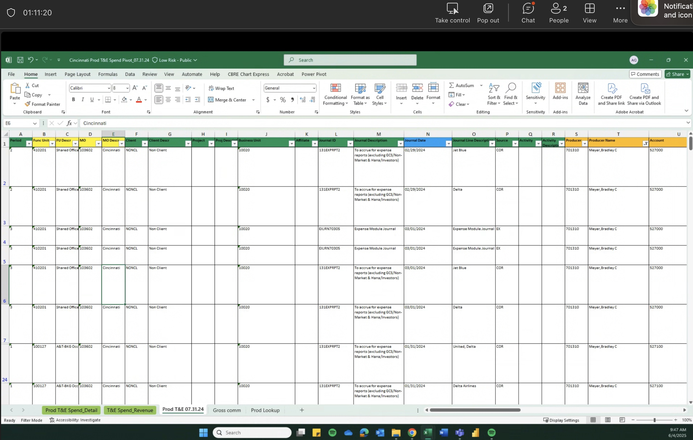

# Meeting Memo with Yao Qin 1st Discussion on PBI Design and Implementation

> 2025-06-04
>
> Yao Qin, Derek Zhu

## Background

Yao Qin, Accounting background, 众邦, 北美中西部，27～28 offices

Data Source: 

1. Sales revenue
2. Balance sheet

## Data Info

### T&E

1. GL Data (T&E), Producer (Broker, Sales team)
2. Dimension: Func Unit, Producer, Account Code, Team
    Producer -> Producer Name -> Team -> Office
3. Fact (Measurement): Base Amount (209.11)

### Gross Comm
1. Fact (Measurement): Traunchable Gross Amount (Column K), Traunch Amount (Column L);
2. Dimension: Office, Producer;
3. Measurement, T&E Spend / GC;
4. Journel Date

## Data Quality

1. Make sure 27 office have same structured data (T&E, Gross Comm);
2. Make sure all data have same field name, sheet name, file name;
3. "T&E", "Gross comm" as sheet name;

> RBAC, Role Based Access Control

---

> 2025-06-10 Meeting Memo

## Data Quality

Column A is employee and team info, not sure about PBI data logic, could be used as major dimension;

T&E, GL