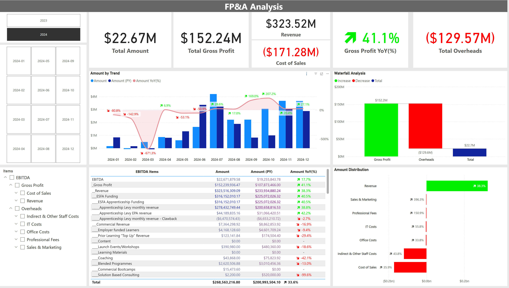

# FP&A Analyst - Case Study

> Author: Xin Huang
>
> Create Date: 2025-06-05
>
> Version: 0.1
>
> Content: Initial version with data cleansing and transformation

---

## Background & Tasks

**Company Overview**

You work for NextGen Learning, a leading provider of Apprenticeship training. The company is focused on growth, operational efficiency, and profitability.

**Scenario**

- The CFO has asked you to prepare a two-page presentation analysing the company’s financial performance in 2024 vs 2023. This analysis will be discussed with the Board and shared with investors, so clarity and insight are critical.

**Your Task**

Using the provided monthly P&L, prepare a structured analysis that includes:

1.	Profit & Loss Summary

    - A clear summary of 2023 vs 2024 financial performance.
    - Commentary of key drivers affecting performance.

2.	Bridge Analysis

    - A visual representation (e.g., waterfall chart) showing the key movements from 2023 to 2024.
    - Breakdown of major factors driving changes in revenue, costs, and EBITDA.

3.	Additional Information & Queries

    - Identify trends, challenges, and opportunities.
    - Highlight any missing information that would improve your analysis.
    - Identify areas requiring further investigation or potential risks.

**Format & Submission**

- Presentation format (PowerPoint)
- Maximum two pages/slides (excluding cover/title page)
- Deadline: 2pm, Monday 9th

---

## Data Cleansing

1. Null value, added formula into excel to complete all level's data

   - "Total Revenue", "ESFA Funding", "Total Cost of Sales", "Direct Staff Costs", etc...

2. Added Items number as dimensional data for data modeling and level indicator, eg:

    | Level         | Item Number    | Item Name    |
    |---------------|----------------|--------------|
    | Level 1       | EBI000000      | EBITDA       |
    | Level 2       | EBI100000      | Gross Profit |
    | Level 3       | EBI110000      | Revenue      |
    | Level 4       | EBI111000      | ESFA Funding |
    | Level 5       | EBI111100      | ESFA Apprenticeship Funding |
    | Level 6       | EBI111101      | Apprenticeship Levy monthly revenue |

3. Removed rows without Item Number, eg: 
   - "Total Total Revenue", "Total Gross Profit", "Total Cost of Sales", etc...

4. ***Data Cleansing*** snapshot


> Refer to pbix file for other detailed transformation steps, eg, remove rows/columns, Unpivot columns, replace Null/error, etc...

---

## Data Modeling

1. Added Items as dimension with indented item name;
2. Added Calendar as date dimension;
3. Added Measurement table to category different DAX measures;

4. ***Data Modeling*** snapshot


## DAX Design & Implementation

1. Total Amount

```sql
amount_0_ebitda = 
var a = CALCULATE(SUM('FP&A'[amount]), FILTER(ALL('Levels'), 'Levels'[Level 0] = "EBITDA"))
return IF(ISBLANK(a), 0, a)
```

2. Total Gross Profit

```sql
amount_1_grossprofit = 
var a = CALCULATE(SUM('FP&A'[amount]), FILTER(ALL('Levels'), 'Levels'[Level 1] = "Gross Profit"))
return IF(ISBLANK(a), 0, a)
```

3. Total Overheads

```sql
amount_1_overheads = 
var a = CALCULATE(SUM('FP&A'[amount]), FILTER(ALL('Levels'), 'Levels'[Level 1] = "Overheads"))
return IF(ISBLANK(a), 0, a)
```

4. Total Revenue

```sql
amount_2_revenue = 
var a = CALCULATE(SUM('FP&A'[amount]), FILTER(ALL('Levels'), 'Levels'[Level 2] = "Revenue"))
return IF(ISBLANK(a), 0, a) // Revenue, Gross Profit
```

5. Total Cost of Sales

```sql
amount_2_costofsales = 
var a = CALCULATE(SUM('FP&A'[amount]), FILTER(ALL('Levels'), 'Levels'[Level 2] = "Cost of Sales"))
return IF(ISBLANK(a), 0, a) // Revenue, Gross Profit
```

---

## Dashboard Design & Implementation



---

## Q&A