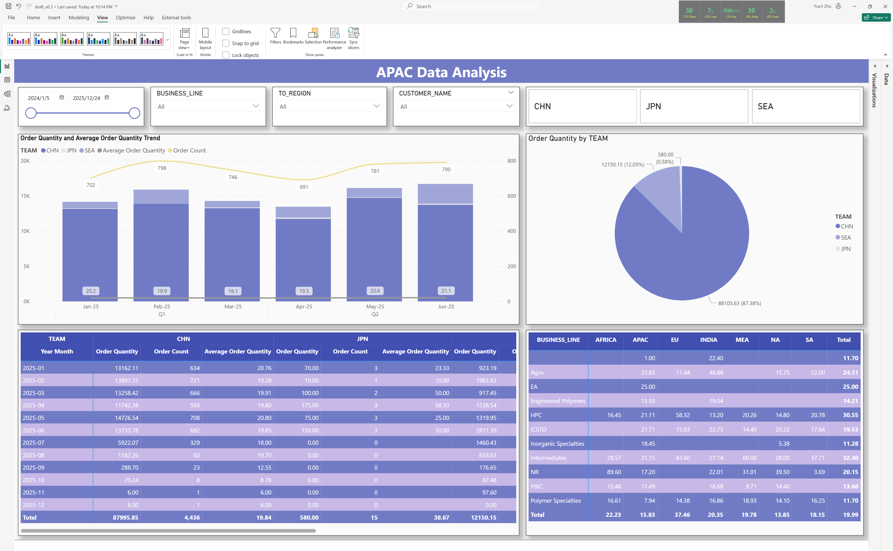

# APAC Data Analysis

> Author: Derek
>
> Create Date: 2025-06-29
>
> Version: 0.1
>
> Content: Initial version with data cleansing and transformation

---

**Requirement**	
1. ignore data "plan month" after present month
2. keep 2023 data in the sheet but exclude from the visualization. 
3. combine china south & china north team into China
4. convert order quantity(column S) and unit(column T) from kg/g into MT(1000KG=1MT), keep PC as is for japan(1pc=1MT)
5. show average of volumn (by quarter)
6. consider show volumn/count by "To region/Business line"


## Data Cleansing


### Metadata

|Column Name                       |Type |
|----------------------------------|-----|
|TEAM                              |-----|
|POL                               |-----|
|TO_REGION                         |-----|
|PRODUCT_TYPE                      |-----|
|PLAN_MONTH                        |-----|
|PRODUCT_HIERARCHY                 |-----|
|ORDER_CREATOR                     |-----|
|ORDER_CREATE_DATE                 |-----|
|SENDING_PLANT                     |-----|
|HAZARD_CLASS                      |-----|
|UN_NO                             |-----|
|ORDER_TYPE                        |-----|
|CUSTOMER_NAME                     |-----|
|FREIGHT_FORWARDER                 |-----|
|ORDER_NO                          |-----|
|MATERIAL                          |-----|
|ORDER_NO_MATERIAL                 |-----|
|PRODUCT_AND_PACKAGE               |-----|
|ORDER_QUANTITY                    |-----|
|UNIT                              |-----|
|INCOTERMS                         |-----|
|DESTINATION                       |-----|
|COUNTRY_REGION                    |-----|
|REQUIRED_DELIVERY_DATE            |-----|
|GOODS_READY_DATE                  |-----|
|INSPECTION_DATE                   |-----|
|STOCK_STATUS                      |-----|
|ETD_FROM_BOOKING_CONFIRMATION     |-----|
|SAIL_TIME                         |-----|
|ETA_FROM_BOOKING_CONFIRMATION     |-----|
|ATD                               |-----|
|LOADING_DATE                      |-----|
|BOOKING_STATUS                    |-----|
|REMARK                            |-----|
|CONTAINER_TYPE                    |-----|
|CONTAINER_QUANTITY                |-----|
|TEU                               |-----|
|OCEAN_CARRIER                     |-----|
|VESSLE_VOYAGE                     |-----|
|BILL_OF_LADING                    |-----|
|TERMINAL                          |-----|
|TENDER_CARRIER_RESOURCE           |-----|
|RATE_TYPE                         |-----|
|REASON_FOR_SPOT_QUOTATION         |-----|
|TOTAL_LOCAL_FREIGHT_POL_CURRENCY  |-----|
|TOTAL_OCEAN_FREIGHT_IN_USD        |-----|
|FIRST_DATE                        |-----|
|DELIVERY_NO                       |-----|
|POD                               |-----|
|REASON_FOR_DELAY_IF_HAVE          |-----|
|TENDER_OCEAN_FREIGHT_USD          |-----|
|SPOT_OCEAN_FREIGHT_USD            |-----|
|BUSINESS_LINE                     |-----|
|PRODUCT_LINE                      |-----|
|PLANNED_GOODS_ISSUE_DATE          |-----|
|ORDER_CURRENCY                    |-----|
|TOTAL_ORDER_AMOUNT                |-----|
|ADDITIONAL_LOCAL_COST_POL_CURRENCY|-----|
|ADDITIONAL_OCEAN_COST_IN_USD      |-----|
|ADDDITONAL_COST_REASON            |-----|


### Data Issue

1. Delivery 6104558378

- Spot Ocean Freight USD
- Total Ocean Freight in USD
> DataFormat.Error: We couldn't convert to Number.
> Details:
>     -

2. Order Number: 
- ETA from booking confirmation date, have "BLANK" value.

## Data Modeling

- Calendar Table as date dimension, date scope is from [ORDER_CREATE_DATE]

```sql
calendar = 
var min_dt = MIN('data'[ORDER_CREATE_DATE])
var max_dt = MAX('data'[ORDER_CREATE_DATE])
return ADDCOLUMNS(
    CALENDAR(min_dt, max_dt),
    "dateid", FORMAT([Date], "yyyy-mm-dd"),
    "year", YEAR([Date]),
    "month", FORMAT([Date],"mm"),
    "year_month", FORMAT([Date],"yyyy-mm"),
    "year_month_abbr", FORMAT([Date], "mmm-yy"),
    "month_eng", FORMAT([Date], "mmmm"),
    "quarter", "Q" & FORMAT([Date], "Q"),
    "day_of_week", FORMAT([Date], "dddd"),
    "week_number", WEEKNUM([Date]),
    "week_day", WEEKDAY([Date]),
    "is_weekend", IF(WEEKDAY([Date], 2) >= 6, 1, 0),
    "start_of_week", [Date] - WEEKDAY([Date], 1) + 1
    )
```


## DAX

1. A measurement table is created to categorize different measures.

```sql
matrics = ROW("kpi_id", BLANK(), "kpi_name", BLANK())
```

2. Order Count
```sql
order_cnt = 
var a = CALCULATE(COUNT(data[ORDER_NO]))
RETURN IF(ISBLANK(a), 0, a)
```

3. Order Quantity
```sql
order_qty = 
var a = CALCULATE(SUM(data[order_quantity_new]))
return IF(ISBLANK(a), 0, a)
```

4. Average Order Quantity
```sql
order_qty_avg = 
DIVIDE([order_qty], [order_cnt])
```


## Visualization

1. Overview


