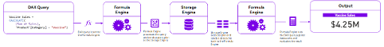
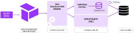

# Power BI DAX Calculation Best Practices

## 1. Objectives

This document contains a DAX guide for Power BI practitioners covering the basics on syntax, formatting, most useful DAX functions, tips and best practices. 

The document is meant to give a quick and easy introduction to address the core DAX concepts, understanding DAX engines, data types and DAX formulas used in calculations.  

---

## 2. Introduction

DAX (Data Analytics Expressions) is a formula-based language used to compute calculated columns and calculated fields. Functions, constants and operators are used in DAX to create expressions and implement business logic in the data model.

DAX can only be used to filter/query a physical table, it cannot add, delete or update data in a table. It is designed for enhancing data modeling, reporting and analytics capabilities built specifically to work with relational data models

DAX is functional language. Every expression is a function call and function parameters can be, in turn, other function calls. The evaluation of parameters might lead to very complex query plans that DAX executes to compute the result.

DAX is the formula language that drives Power BI. With DAX you can:
-Add calculated columns and measures to your model, using intuitive syntax
-Go beyond the capabilities of traditional “grid-style” formulas, with powerful and flexible functions built specifically to work with relational data models

---

### CALCULATED COLUMNS

**Calculated columns** allow you to add new, formula-based columns to tables

- Calculated columns refer to entire tables or columns 
- Calculated columns generate values for each row, which are visible within tables in the Data view
- Calculated columns understand row context; they’re great for defining properties based on information in each row, but generally useless for aggregation (SUM, COUNT, etc.)

**Rules of thumb for calculated columns:**

- Use calculated columns when you want to hardcode static/fixed values to each row in a table (or use the Query Editor)
- DO NOT use calculated columns for aggregation formulas, or to calculate fields for the “Values” area of a visualization (use measures instead)
- Calculated columns are typically used for filtering data, rather than creating numerical values
- Primarily used as rows, columns, slicers or filters

---

### MEASURES

**Measures** are DAX formulas used to generate new calculated values

- Like calculated columns, measures reference entire tables or columns 
- Unlike calculated columns, measure values aren’t visible within tables; they can only be “seen” within a visualization like a chart or matrix 
- Measures are evaluated based on filter context, which means they recalculate when the fields or filters around them change (like when new row or column labels are pulled into a matrix or when new filters are applied to a report)

**Rules of thumb for measures:**

- As a rule of thumb, use measures (vs. calculated columns) when a single row can’t give you the answer (in other words, when you need to aggregate)
- Does not create new data in the tables themselves (doesn’t increase file size)
- Use measures to create numerical, calculated values that can be analyzed in the “values” field of a report visual

---

## 3. DAX Engines

DAX is powered by 2 internal engines (**Formula engine** and **Storage engine**) which work together to compress and encode raw data and evaluate DAX queries.

> Note: Although these engines operate behind the scenes, knowing how they work will help you build advanced skills by understanding how DAX “thinks”

When a DAX query is executed, a combination of the Formula engine and the Storage engine is used to resolve the query and return an answer.

In the process, the following steps are taken:

1. The query is transformed into an expression tree.
2. A logical query plan, containing the set of logical operations needed to execute the query, is produced.
3. The logical query plan is transformed into a physical query plan, containing the set of physical operations needed.
4. The physical query plan is executed, and data is retrieved from the storage engine, allowing the result of the query to be calculated.

> Steps 2 and 3 are particularly important when it comes to optimizing DAX queries. It is these steps that produce the plans that we can read, allowing us to understand how the query engine resolves our queries.

**Formula Engine**

- Receives, interprets, and executes all DAX requests
- Processes the DAX query then generates a list of logical steps called a query plan
- Works with the datacache sent back from the storage engine to evaluate the DAX query and return a result

**Storage Engine**

- Compresses and encodes raw data, and only communicates with the formula engine (doesn’t understand the DAX language)
- Receives a query plan from Formula Engine, executes it, and returns a datacache

> Note: There are 2 types of storage engines based on the type of connection:
    > 1. Vertipaq Engine: is utilized for imported data and offers extremely quick query performance by utilizing highly compressed in-memory columnar storage. The highly efficient format used for data storage makes retrieval and aggregation faster. 
    > 2. DirectQuery/Composite Model Engine: is used to retrieve data in real time by creating SQL queries (or other query languages) that retrieve data straight from the database. Because DirectQuery receives new data on-demand rather than using cached data like VertiPaq does, it is helpful in situations where up-to-date information is needed. 

### Query Evaluation Process

When a DAX query is executed, the following steps occur:

1. Query Submission: The Formula Engine takes over when a DAX query is run, either through DAX Studio or in a report visual. 
2. Parsing and Optimization: To generate a query plan, the Formula Engine parses the query, divides it into more manageable, smaller steps, and simplifies the logic. 
3. Data Request to Storage Engine: The Formula Engine notifies the Storage Engine with the desired data if it is not already in memory. 
>In DirectQuery mode, the Storage Engine generates a SQL query to retrieve real-time data, or it can retrieve the necessary data from the VertiPaq cache for imported data. 
4. Computation and Execution: The Formula Engine provides the final result by applying the required DAX expressions and computations once the Storage Engine provides the data. 
5. Aggregation and Output: After being combined and structured, the calculated results are sent back to the query output or report visual. 

  

  

